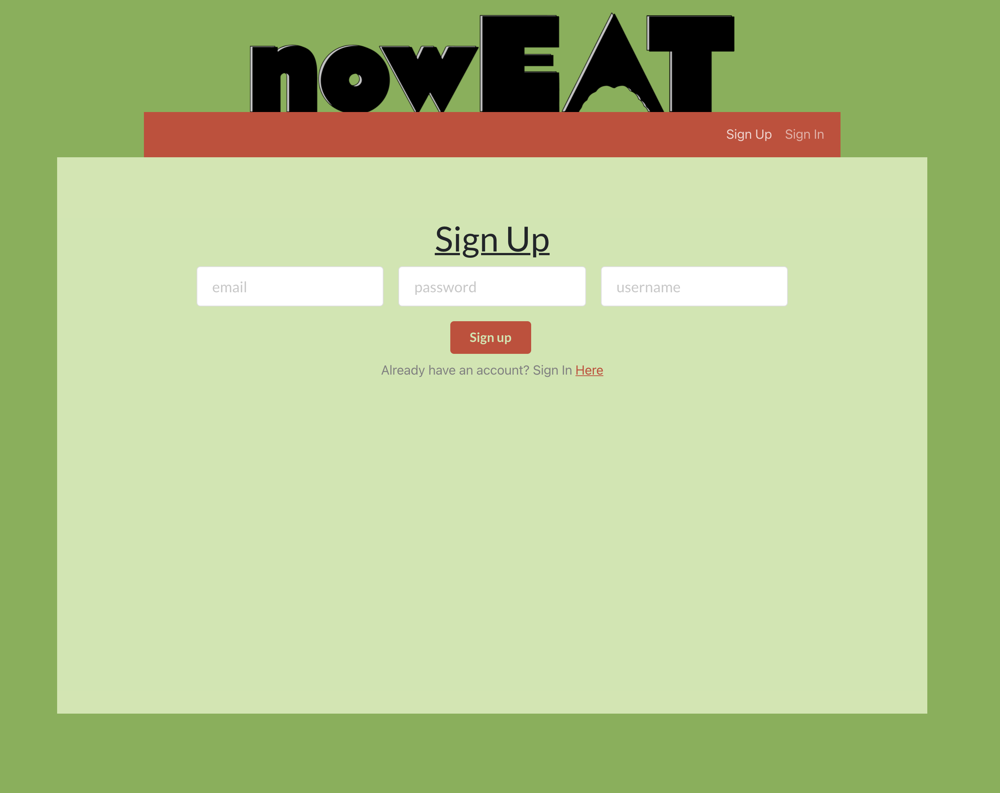
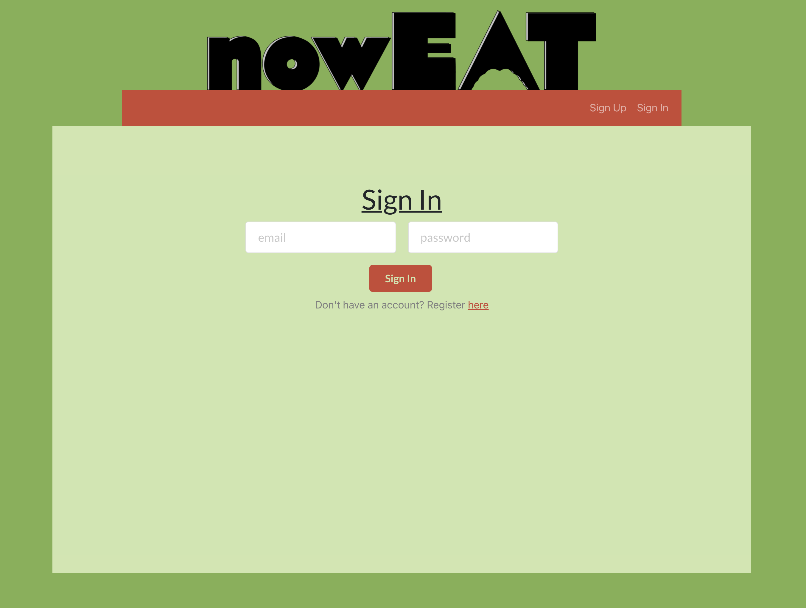
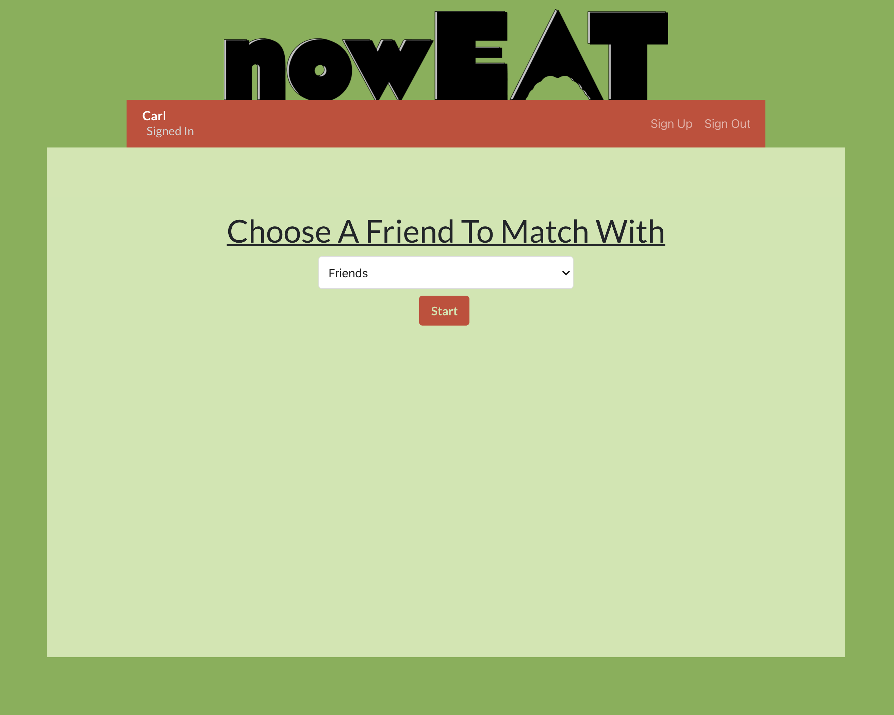
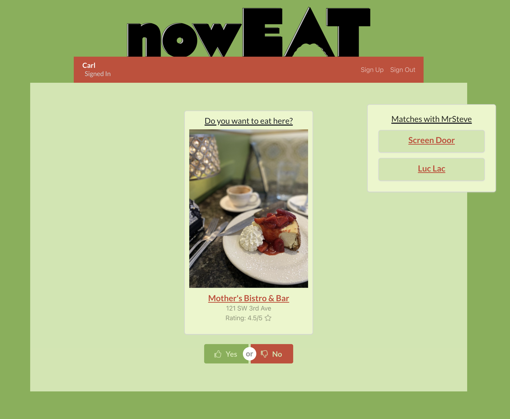
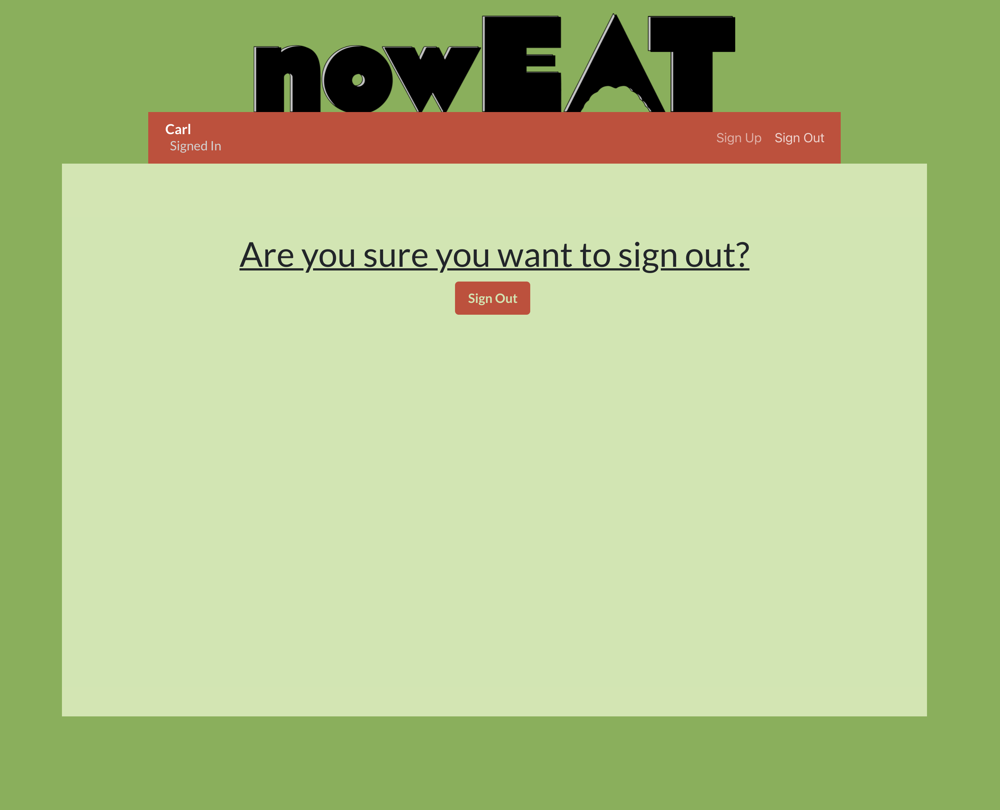

# _NOW EAT_

#### _A web application designed to alleviate the stress of choosing a place to eat based on a matching system that compares destinations users select whether or not they would like to go_

#### By _Ryan Walker_

## Description
Now Eat is an application that will allow users to compare interests in restaurants and return those that match. Built with React/Redux, Now Eat uses the NoSQL cloud-hosted databases Firebase, for user authentication, and Firestore, for holding user data and information about restaurants. Users have the ability to create accounts, match with friends, and choose restaurants that they would like to eat at. Now Eat will take away all of the guess-work when it comes to deciding where to eat as a couple or a group. 

## Components

## User Stories
* Sign Up Screen: A user will have the ability to create an account using their email address and a unique password. They will also be able to choose a username. 
* Sign In Screen: A user will be able to sign in to their account.
* Select Friend Screen: A user will be able to choose which of their friends they would like to compare matches with. 
* Application Screen: 
  * A user will be presented with restaurants one at a time from their field of choice. 
  * They will have the option to choose if they would like to eat at the restaurant or not. 
  * They will be shown matches for 'yes' answers between themselves and the person they have chosen to compare matches with. 
* Sign Out Screen: A user will have the ability to sign out from their account.

## Setup and Use

### Prerequisites
* A text editor like [VS Code](https://code.visualstudio.com/)
* A command line interface like Terminal or GitBash to run and interact with the app.

### Installation
1. Clone the repository: `$ git clone https://github.com/RyanDanielWalker/now-eat`
2. Navigate to the `/now-eat` directory on your computer
3. Open with your preferred text editor to view the code base
4. To run the app:
    * Run the command `npm start` to run the project!
    * View the application via your preferred web browser by visiting `localhost:3000/`

## Known Bugs
#### Works in progress:
* If user has chosen restaurants already, matches will not register with selected friend. 
* New user not shown in toolbar upon account creation

## Technologies Used
* JavaScript
* React
* Redux
* Firebase
* Firestore
* JSX
* VS Code
* NPM
* Git
* GitHub
* Webpack
* Adobe Illustrator

### License

MIT

Copyright (c) 2021 _Ryan Walker_

## Contact Information
[Ryandanielwalker@gmail.com](mailto:ryandanielwalker@gmail.com)